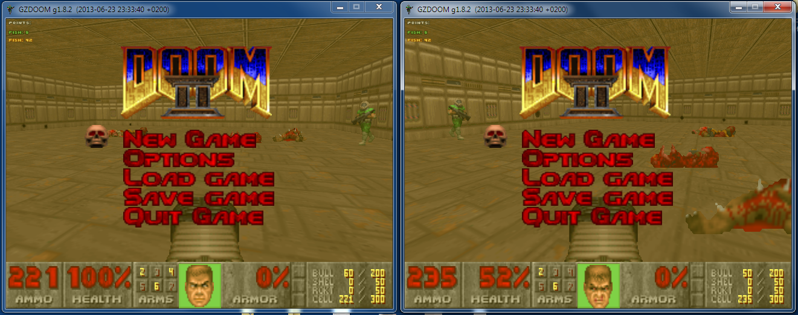

# doom_scoring

## Project goal:
Create extension pk3 (or wad) to add arcade-style player scoring to Doom (gzdoom) without modifying the game binary, IWADs or PWADs. When zdoom is run with this additional pk3, in-game scoring should work out-of-the-box with all maps. In cooperative mode, every player will see the entire scoreboard and be able to compare their current score with others.

## Overview
The extension adds a script that calculates and displays player scores in the HUD. Points for killing monsters are generated by extending monsters' death actions. This means that the single extension pk3 works with any map out of the box, but on the other hand, a different pk3 must be created for any mod that modifies monsters or adds some new (like Brutal Doom for example).

## Building the pk3
### Tools
* Python 3
* [Slade wad editor](http://slade.mancubus.net/)
* [acc ACS compiler](http://zdoom.org/wiki/ACC)

### Target archive layout
pk3:
* ACS/
   * SCORE.o
* DECORATE
* LOADACS
* other files produced by lump\_generator

In WAD, the structure would be similar. The ACS directory would be replaced with `A_START` and `A_END` markers and `SCORE` would have no extension.

### Compiling ACS
If you pack SCORE.ACS together with your map, it doesn't have to be compiled; zdoom can interpret it from source form. However, to create a generic pk3 that would work as an extension to any map, the script must be compiled and also the `LOADACS` file must be included in the pk3.

To compile the ACS, simply run `acc SCORE.ACS`.

### Generating DECORATE
The `DECORATE` and `PNTRANK` files included in the repository were used as proof-of-concept only. To make scoring work for all monsters, it is necessary to create new actors in the `DECORATE` file for each monster. That is a lot of typing and even worse, it needs to be done for every mod that creates new monsters or alters the existing ones (e.g. Brutal Doom).

That is the task for lump\_generator; this python tool creates `DECORATE` monster actors automatically from the data taken from the original `DECORATE` file.

General steps:

1. Unpack `DECORATE` and files included from it of the mod that you want to add scoring to (see below for vanilla Doom). Let's assume that the unpacked files are in directory called `original/`.
1. Run lump\_generator.
`python main.py -i original -o new`
1. Edit the `pointconstants` file in the `new/` directory. Here you can define, how many points to give to the user for killing each monster. Initially, all rewards are set to 0. For inspiration, take a look at pre-configured `pointconstants` files in the `pointConstants` directory in the repository.
1. Import `DECORATE` and all the other files from the `new/` directory to the root of the pk3 file.

Doom/Doom2.wad doesn't have any `DECORATE` lumps for the original Doom monsters. However, zdoom source code does contain them. Monster definitions for the monsters from the original game can be found in the zdoom source code in `wadsrc/static/actors/doom`. It doesn't include any global `DECORATE` file however, which is needed for the lump\_generator. That is easy to overcome. In the `actors/doom` directory, run

`for f in *.txt; do echo "#include $f" >> DECORATE; done`

Then this directory can be used as the input for lump\_generator.

